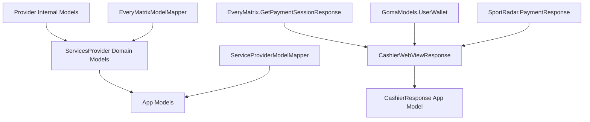

# API Development Guide

## Overview

This guide provides step-by-step instructions for adding new API endpoints to any provider in the ServicesProvider framework. It covers the complete data flow from raw API responses to UI consumption, following the established 3-layer model architecture.

## 3-Layer Model Architecture

The codebase follows a strict **3-layer model architecture** that ensures clean separation of concerns and provider independence:



### Layer 1: Provider-Specific Internal Models
- **Location**: `/Frameworks/ServicesProvider/Sources/ServicesProvider/Providers/{Provider}/Models/`
- **Purpose**: Codable structs that exactly match the API response structure
- **Examples**: `EveryMatrix.WalletBalance`, `GomaModels.UserProfile`, `SportRadar.MatchData`

### Layer 2: ServicesProvider Domain Models
- **Location**: `/Frameworks/ServicesProvider/Sources/ServicesProvider/Models/`
- **Purpose**: Provider-agnostic domain models that abstract away provider differences
- **Examples**: `UserWallet`, `CashierWebViewResponse`, `SportType`

### Layer 3: App Models (Optional)
- **Location**: `/BetssonCameroonApp/App/Models/`
- **Purpose**: Simplified models optimized for UI consumption
- **Examples**: `UserWallet` (app), `Sport` (app), `Match` (app)

## Step-by-Step Guide: Adding a New API Endpoint

### Step 1: Create Provider-Specific Internal Models

**For EveryMatrix Provider:**

1. Create a new file: `/Providers/Everymatrix/Models/Shared/EveryMatrix+{Feature}.swift`

```swift
//  EveryMatrix+Payment.swift
import Foundation

extension EveryMatrix {
    
    /// Raw API response from EveryMatrix
    struct PaymentStatusResponse: Codable {
        let status: String
        let transactionId: String
        let amount: AmountDetails
        
        enum CodingKeys: String, CodingKey {
            case status = "Status"
            case transactionId = "TransactionId" 
            case amount = "Amount"
        }
    }
    
    struct AmountDetails: Codable {
        let value: Double
        let currency: String
        
        enum CodingKeys: String, CodingKey {
            case value = "Value"
            case currency = "Currency"
        }
    }
}
```

**For Other Providers:**
- Goma: `/Providers/Goma/Models/GomaModels+{Feature}.swift`
- SportRadar: `/Providers/Sportsradar/Models/SportRadar+{Feature}.swift`

### Step 2: Define ServicesProvider Domain Model

Create provider-agnostic domain model in `/Models/{Category}/`:

```swift
//  PaymentStatusResponse.swift
import Foundation

/// Provider-agnostic payment status response
public struct PaymentStatusResponse: Equatable {
    
    public let status: PaymentStatus
    public let transactionId: String
    public let amount: Double
    public let currency: String
    
    public init(status: PaymentStatus, transactionId: String, amount: Double, currency: String) {
        self.status = status
        self.transactionId = transactionId
        self.amount = amount
        self.currency = currency
    }
}

public enum PaymentStatus: String, CaseIterable {
    case pending = "pending"
    case completed = "completed"
    case failed = "failed"
    case cancelled = "cancelled"
}
```

### Step 3: Add API Endpoint Definition

Add the endpoint to the provider's API enum:

```swift
//  EveryMatrixPlayerAPI.swift
enum EveryMatrixPlayerAPI {
    // ... existing cases
    case getPaymentStatus(userId: String, transactionId: String)
}

extension EveryMatrixPlayerAPI: Endpoint {
    var endpoint: String {
        switch self {
        // ... existing cases
        case .getPaymentStatus(let userId, let transactionId):
            return "/v1/player/\(userId)/payment/\(transactionId)/status"
        }
    }
    
    var method: HTTP.Method {
        switch self {
        // ... existing cases
        case .getPaymentStatus:
            return .get
        }
    }
    
    // ... other endpoint properties
}
```

### Step 4: Create Model Mapper

Create mapper from internal models to domain models:

```swift
//  EveryMatrixModelMapper+Payment.swift
import Foundation

extension EveryMatrixModelMapper {
    
    /// Maps EveryMatrix payment status response to domain model
    static func paymentStatusResponse(from response: EveryMatrix.PaymentStatusResponse) -> PaymentStatusResponse {
        
        let status: PaymentStatus
        switch response.status.lowercased() {
        case "completed": status = .completed
        case "pending": status = .pending  
        case "failed": status = .failed
        case "cancelled": status = .cancelled
        default: status = .pending
        }
        
        return PaymentStatusResponse(
            status: status,
            transactionId: response.transactionId,
            amount: response.amount.value,
            currency: response.amount.currency
        )
    }
}
```

### Step 5: Add Method to Provider Manager

Add the new method to the appropriate provider manager:

```swift
//  EveryMatrixPrivilegedAccessManager.swift
func getPaymentStatus(transactionId: String) -> AnyPublisher<PaymentStatusResponse, ServiceProviderError> {
    let currentUserId = sessionCoordinator.currentUserId ?? ""
    let endpoint = EveryMatrixPlayerAPI.getPaymentStatus(userId: currentUserId, transactionId: transactionId)
    
    // Make API call with internal models
    let publisher: AnyPublisher<EveryMatrix.PaymentStatusResponse, ServiceProviderError> = connector.request(endpoint)
    
    // Map internal response to domain model
    return publisher
        .map { response in
            EveryMatrixModelMapper.paymentStatusResponse(from: response)
        }
        .eraseToAnyPublisher()
}
```

### Step 6: Add Method to Protocol

Add the method signature to the provider protocol:

```swift
//  PrivilegedAccessManager.swift
public protocol PrivilegedAccessManagerProvider {
    // ... existing methods
    func getPaymentStatus(transactionId: String) -> AnyPublisher<PaymentStatusResponse, ServiceProviderError>
}
```

### Step 7: Update Public Client Interface

Add the method to the public ServicesProvider.Client:

```swift
//  Client.swift
public func getPaymentStatus(transactionId: String) -> AnyPublisher<PaymentStatusResponse, ServiceProviderError> {
    guard let privilegedAccessManager = self.privilegedAccessManager else {
        return Fail(error: ServiceProviderError.privilegedAccessManagerNotFound).eraseToAnyPublisher()
    }
    return privilegedAccessManager.getPaymentStatus(transactionId: transactionId)
}
```

### Step 8: Create App Models (Optional)

If the UI needs a simplified model, create app-level models:

```swift
//  /BetssonCameroonApp/App/Models/Payments/PaymentStatus.swift
import Foundation

struct PaymentStatus: Codable, Hashable {
    let isCompleted: Bool
    let displayMessage: String
    let amount: String
}
```

### Step 9: Create App Model Mapper (Optional)

If app models are needed, create the mapper:

```swift
//  ServiceProviderModelMapper+Payments.swift
extension ServiceProviderModelMapper {
    
    static func paymentStatus(from response: PaymentStatusResponse) -> PaymentStatus {
        let isCompleted = response.status == .completed
        let displayMessage = response.status.rawValue.capitalized
        let amount = String(format: "%.2f %@", response.amount, response.currency)
        
        return PaymentStatus(
            isCompleted: isCompleted,
            displayMessage: displayMessage,
            amount: amount
        )
    }
}
```

### Step 10: Usage in ViewModels

Use the API in your ViewModels:

```swift
//  PaymentViewModel.swift
import ServicesProvider

class PaymentViewModel {
    private let client: ServicesProvider.Client
    
    func checkPaymentStatus(transactionId: String) {
        client.getPaymentStatus(transactionId: transactionId)
            .receive(on: DispatchQueue.main)
            .sink(
                receiveCompletion: { completion in
                    // Handle completion
                },
                receiveValue: { response in
                    // Convert to app model if needed
                    let appModel = ServiceProviderModelMapper.paymentStatus(from: response)
                    // Update UI
                }
            )
            .store(in: &cancellables)
    }
}
```

## Testing Your Implementation

### 1. Test with curl (if applicable)

```bash
curl 'https://api.example.com/v1/player/123/payment/abc/status' \
  -H 'Authorization: Bearer token' \
  -H 'Content-Type: application/json'
```

### 2. Verify Model Mapping

Create unit tests for your mappers:

```swift
func testPaymentStatusMapping() {
    let everyMatrixResponse = EveryMatrix.PaymentStatusResponse(
        status: "Completed",
        transactionId: "abc123",
        amount: EveryMatrix.AmountDetails(value: 100.0, currency: "EUR")
    )
    
    let domainModel = EveryMatrixModelMapper.paymentStatusResponse(from: everyMatrixResponse)
    
    XCTAssertEqual(domainModel.status, .completed)
    XCTAssertEqual(domainModel.amount, 100.0)
    XCTAssertEqual(domainModel.currency, "EUR")
}
```

### 3. Build and Test

```bash
cd /Users/rroques/Desktop/GOMA/iOS/sportsbook-ios
xcodebuild -workspace Sportsbook.xcworkspace -scheme BetssonCameroonApp -destination 'platform=iOS Simulator,id=DEVICE_ID' build
```

## Common Patterns and Examples

### 1. Authentication Required Endpoints

```swift
var requireSessionKey: Bool {
    switch self {
    case .getPaymentStatus:
        return true
    default:
        return false
    }
}
```

### 2. POST Requests with Body

```swift
var body: Data? {
    switch self {
    case .createPayment(let request):
        return try? JSONEncoder().encode(request)
    default:
        return nil
    }
}
```

### 3. Error Handling

```swift
.catch { error in
    // Map provider-specific errors to domain errors
    return Fail(error: ServiceProviderError.networkError(error.localizedDescription))
}
```

## Reference Files

For complete examples of this pattern in action, refer to:

- **EveryMatrix**: `/Providers/Everymatrix/Models/Mappers/EveryMatrixModelMapper+WalletBalance.swift`
- **Model Structure**: `/Providers/Everymatrix/Models/Shared/EveryMatrix+WalletBalance.swift`
- **Domain Models**: `/Models/User/User.swift` (UserWallet)
- **App Models**: `/BetssonCameroonApp/App/Models/User/UserWallet.swift`
- **App Mappers**: `/BetssonCameroonApp/App/Models/ModelsMapping/ServiceProviderModelMapper+Sports.swift`

## Best Practices

1. **Always follow the 3-layer architecture** - Never skip layers or map directly between non-adjacent layers
2. **Use descriptive names** - Model names should clearly indicate their purpose and layer
3. **Provider-agnostic domain models** - Never include provider-specific details in domain models
4. **Comprehensive error handling** - Map all provider errors to appropriate domain errors
5. **Unit test mappers** - Model mapping is critical and should be thoroughly tested
6. **Document complex mappings** - Add comments explaining any non-obvious mapping logic

## Troubleshooting

### Common Issues:

1. **Compilation errors after adding new models**
   - Ensure all CodingKeys match the API exactly
   - Verify import statements are correct

2. **Runtime decoding failures**
   - Check API response structure with curl
   - Validate CodingKeys against actual response

3. **Missing protocol methods**
   - Implement the method in all provider managers
   - Add appropriate default implementations where needed

This guide ensures consistent implementation across all providers while maintaining the clean architecture that makes the codebase maintainable and scalable.