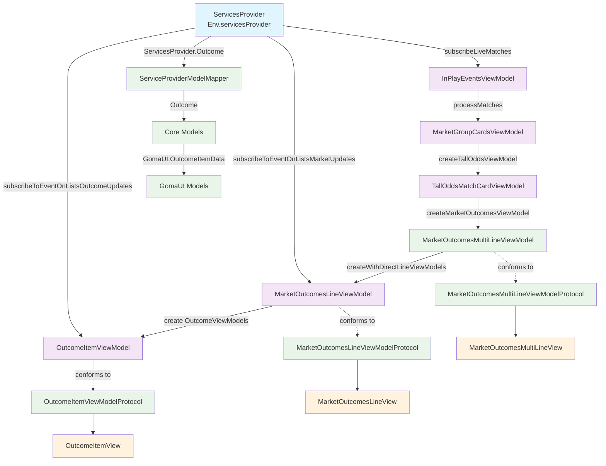
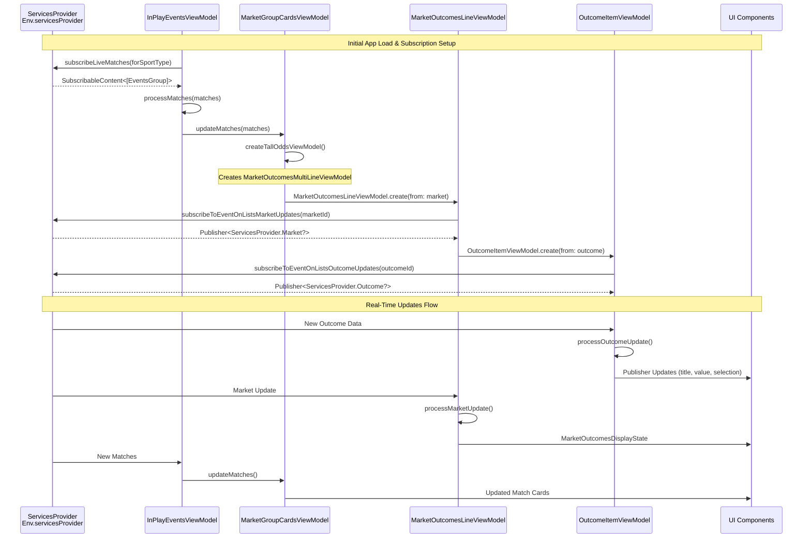

# Sportsbook iOS Data Flow Architecture

## 1. High-Level Architecture Overview



## 2. Real-Time Subscription Chain



## 3. ViewModel Hierarchy & Factory Pattern

```mermaid
graph TD
    %% Root Level
    IPE[InPlayEventsViewModel<br/>📍 Core/Screens/InPlayEvents/]
    
    %% Market Group Level
    IPE --> MGCVM[MarketGroupCardsViewModel<br/>📍 Core/Screens/NextUpEvents/]
    MGCVM --> |"factory: createTallOddsViewModel()"| TOMCVM[TallOddsMatchCardViewModel<br/>📍 Core/ViewModels/]
    
    %% Match Card Level  
    TOMCVM --> MH[MatchHeaderViewModel]
    TOMCVM --> MIL[MarketInfoLineViewModel]
    TOMCVM --> |"factory: createMarketOutcomesViewModel()"| MOMLVM[MarketOutcomesMultiLineViewModel<br/>📍 Core/ViewModels/]
    
    %% Multi-Line Level
    MOMLVM --> |"factory: createWithDirectLineViewModels()"| MOL1[MarketOutcomesLineViewModel #1<br/>📍 Core/ViewModels/]
    MOMLVM --> MOL2[MarketOutcomesLineViewModel #2]
    MOMLVM --> MOL3[MarketOutcomesLineViewModel #n]
    
    %% Line Level
    MOL1 --> |"factory: create(from: market)"| OI1[OutcomeItemViewModel - Left<br/>📍 Core/ViewModels/]
    MOL1 --> OI2[OutcomeItemViewModel - Middle]
    MOL1 --> OI3[OutcomeItemViewModel - Right]
    
    %% Data Subscriptions
    IPE -.-> |subscribeLiveMatches| SP[ServicesProvider]
    MOL1 -.-> |subscribeToMarketUpdates| SP
    OI1 -.-> |subscribeToOutcomeUpdates| SP
    
    %% Protocol Conformance
    OI1 -.-> |implements| OIVMP[OutcomeItemViewModelProtocol<br/>📍 GomaUI/Components/]
    MOL1 -.-> |implements| MOLVMP[MarketOutcomesLineViewModelProtocol<br/>📍 GomaUI/Components/]
    MOMLVM -.-> |implements| MOMLVMP[MarketOutcomesMultiLineViewModelProtocol<br/>📍 GomaUI/Components/]

    %% Styling
    classDef rootLevel fill:#ffebee
    classDef groupLevel fill:#f3e5f5
    classDef cardLevel fill:#e8eaf6
    classDef lineLevel fill:#e0f2f1
    classDef outcomeLevel fill:#fff8e1
    classDef protocol fill:#e1f5fe
    classDef service fill:#fce4ec

    class IPE rootLevel
    class MGCVM groupLevel
    class TOMCVM,MH,MIL,MOMLVM cardLevel
    class MOL1,MOL2,MOL3 lineLevel
    class OI1,OI2,OI3 outcomeLevel
    class OIVMP,MOLVMP,MOMLVMP protocol
    class SP service
```



## 4. Data Transformation Pipeline

```mermaid
flowchart LR
    %% ServicesProvider Data
    subgraph "ServicesProvider Layer"
        SPO["ServicesProvider.Outcome<br/>• id: String<br/>• translatedName: String<br/>• bettingOffer: BettingOffer"]
        SPM["ServicesProvider.Market<br/>• id: String<br/>• outcomes: Array of Outcome<br/>• isAvailable: Bool"]
        SPE["ServicesProvider.EventsGroup<br/>• matches: Array of Match"]
    end
    
    %% Mapper Layer
    subgraph "ServiceProviderModelMapper"
        SPMMM["ServiceProviderModelMapper<br/>📍 Core/Services/"]
        SPMMM --> |outcome()| IO[Internal Outcome]
        SPMMM --> |market()| IM[Internal Market]  
        SPMMM --> |matches()| IMA["Internal Match Array"]
    end
    
    %% Core Internal Models
    subgraph "Core Models"
        IO["Outcome<br/>• id: String<br/>• translatedName: String<br/>• bettingOffer: BettingOffer<br/>• orderValue: Int?"]
        IM["Market<br/>• id: String<br/>• outcomes: Array of Outcome<br/>• isAvailable: Bool"]
        IMA["Match<br/>• id: String<br/>• markets: Array of Market"]
    end
    
    %% GomaUI Data Models
    subgraph "GomaUI Models"
        MOID["MarketOutcomeData<br/>• id: String<br/>• title: String<br/>• value: String (formatted)<br/>• oddsChangeDirection: OddsChangeDirection<br/>• isSelected: Bool<br/>• isDisabled: Bool"]
        
        OIID["OutcomeItemData<br/>• id: String<br/>• title: String<br/>• value: String (formatted)<br/>• displayState: OutcomeDisplayState<br/>• oddsChangeDirection: OddsChangeDirection<br/>• previousValue: String?<br/>• changeTimestamp: Date?"]
    end
    
    %% Data Flow
    SPO --> SPMMM
    SPM --> SPMMM
    SPE --> SPMMM
    
    IO --> |OddFormatter.formatOdd()| MOID
    IO --> |OddFormatter.formatOdd()| OIID
    
    %% Key Transformations
    subgraph "Key Transformations"
        OF["OddFormatter.formatOdd()<br/>Double → String<br/>1.85 → '1.85'"]
        DS["DisplayState Logic<br/>isAvailable → displayState<br/>true → .normal(selected, boosted)<br/>false → .unavailable"]
        OCD["OddsChangeDirection<br/>Auto-calculated from<br/>old vs new values"]
    end
    
    IO -.-> OF
    IO -.-> DS
    OIID -.-> OCD

    %% Styling
    classDef servicesProvider fill:#e1f5fe
    classDef mapper fill:#f3e5f5
    classDef coreModels fill:#e8f5e8
    classDef gomaUIModels fill:#fff3e0
    classDef transformations fill:#fce4ec

    class SPO,SPM,SPE servicesProvider
    class SPMMM mapper
    class IO,IM,IMA coreModels
    class MOID,OIID gomaUIModels
    class OF,DS,OCD transformations
```

## Key Implementation Files Reference

| Component | File Location | Key Responsibilities |
|-----------|---------------|---------------------|
| **InPlayEventsViewModel** | `Core/Screens/InPlayEvents/InPlayEventsViewModel.swift` | Root data orchestration, live match subscriptions |
| **MarketGroupCardsViewModel** | `Core/Screens/NextUpEvents/MarketGroupCardsViewModel.swift` | Match filtering, card creation |
| **OutcomeItemViewModel** | `Core/ViewModels/OutcomeItemViewModel.swift` | Individual outcome management, real-time updates |
| **MarketOutcomesLineViewModel** | `Core/ViewModels/MarketOutcomesLineViewModel.swift` | Market line management, outcome coordination |
| **ServiceProviderModelMapper** | `Core/Services/ServiceProviderModelMapper.swift` | Data transformation layer |
| **OutcomeItemViewModelProtocol** | `GomaUI/Components/OutcomeItemView/OutcomeItemViewModelProtocol.swift` | UI interface contracts |

## Architecture Principles

1. **Reactive Programming**: Extensive use of Combine publishers for real-time updates
2. **Protocol-Oriented Design**: Clear separation between UI contracts and implementation
3. **Factory Pattern**: Centralized ViewModel creation with proper dependency injection
4. **Hierarchical State Management**: Parent ViewModels manage child lifecycle and data flow
5. **Real-Time Subscriptions**: Multiple subscription layers for granular live updates
6. **Data Transformation**: Clean separation between service models and UI models

## 5. ViewModel Creation vs Recreation Analysis

```mermaid
graph TB
    subgraph "❌ PERFORMANCE ISSUES"
        IPE[InPlayEventsViewModel] --> |"processMatches()<br/>🔄 Every Market Update"| MGCVM[MarketGroupCardsViewModel]
        MGCVM --> |"createMatchCardData()<br/>❌ ALWAYS RECREATES<br/>🗑️ No reuse mechanism"| TOMCVM[TallOddsMatchCardViewModel]
        TOMCVM --> |"❌ Complex hierarchy recreation<br/>🔄 Re-establishes subscriptions<br/>💾 Memory churn"| CASCADE[Cascading Recreation]
    end
    
    subgraph "✅ GOOD REUSE PATTERNS"
        TOMCVM2[TallOddsMatchCardViewModel] --> |"✅ Subject-based updates<br/>♻️ Reuses child ViewModels"| CHILDREN[Child ViewModels]
        MOLVM[MarketOutcomesLineViewModel] --> |"✅ Smart diffing logic<br/>updateOutcomeViewModels()"| SMART[Intelligent Recreation]
        SMART --> |"Only creates when needed<br/>if outcomeViewModels[type] == nil"| OI[OutcomeItemViewModel]
        SMART --> |"♻️ Reuses existing instances<br/>print('Reusing existing')"| REUSE[Cached ViewModels]
    end
    
    subgraph "🎯 RECREATION TRIGGERS"
        T1[New Match Data<br/>📡 ServicesProvider update] --> |Frequency: ~1-5 sec| MGCVM
        T2[Market Structure Change<br/>📊 Outcomes added/removed] --> |Frequency: Rare| MOLVM
        T3[Odds Value Change<br/>💰 Individual outcome update] --> |Frequency: ~0.5-2 sec| OI
        T4[Market Selection Change<br/>👆 User interaction] --> |Frequency: User-driven| SELECTION[Selection State Update]
    end
    
    subgraph "🏗️ AVAILABLE INFRASTRUCTURE"
        VC[ViewModelCache<Key, ViewModel><br/>📍 Thread-safe generic cache<br/>✅ Concurrent queue support]
        EXAMPLES[Usage Examples:<br/>• LiveEventsViewModel<br/>• SuggestedBetLineViewModel<br/>❌ NOT used in key ViewModels]
    end
    
    subgraph "📊 RECREATION FREQUENCY"
        HIGH[🔴 HIGH RECREATION<br/>MarketGroupCardsViewModel<br/>Every market update = Full recreation<br/>Cost: Expensive]
        MEDIUM[🟡 SMART RECREATION<br/>MarketOutcomesLineViewModel<br/>Only when structure changes<br/>Cost: Moderate]
        LOW[🟢 MINIMAL RECREATION<br/>OutcomeItemViewModel<br/>Updates via subscriptions<br/>Cost: Cheap]
    end

    %% Connections
    T1 --> HIGH
    T2 --> MEDIUM
    T3 --> LOW
    T4 --> LOW
    
    %% Styling
    classDef problemArea fill:#ffebee,stroke:#d32f2f,stroke-width:3px
    classDef goodPattern fill:#e8f5e8,stroke:#388e3c,stroke-width:2px
    classDef infrastructure fill:#e3f2fd,stroke:#1976d2,stroke-width:2px
    classDef frequency fill:#fff3e0,stroke:#f57c00,stroke-width:2px
    classDef trigger fill:#f3e5f5,stroke:#7b1fa2,stroke-width:2px

    class IPE,MGCVM,CASCADE problemArea
    class TOMCVM2,CHILDREN,MOLVM,SMART,OI,REUSE goodPattern
    class VC,EXAMPLES infrastructure
    class HIGH,MEDIUM,LOW frequency
    class T1,T2,T3,T4,SELECTION trigger
```



## Recreation Impact Analysis

| ViewModel Level | Recreation Frequency | Trigger | Current Pattern | Recommendation |
|----------------|---------------------|---------|----------------|----------------|
| **MarketGroupCardsViewModel** | 🔴 **Every market update** | ServicesProvider data | ❌ Always recreates children | ✅ Implement caching by match ID |
| **TallOddsMatchCardViewModel** | 🔴 **Inherited from parent** | Parent recreation | ❌ Complex hierarchy rebuilt | ✅ Use ViewModelCache infrastructure |
| **MarketOutcomesLineViewModel** | 🟡 **Structure changes only** | Market outcomes change | ✅ Smart diffing logic | ✅ Already optimized |
| **OutcomeItemViewModel** | 🟢 **Rare** | Outcome removal | ✅ Real-time updates | ✅ Already optimized |

## Performance Recommendations

### 1. **Critical Fix: MarketGroupCardsViewModel Caching**
```swift
// Current (Performance Issue)
private func createMatchCardData(from filteredMatches: [FilteredMatchData]) -> [MatchCardData] {
    return filteredMatches.map { filteredData in
        let tallOddsViewModel = createTallOddsViewModel(from: filteredData) // ❌ Always creates new
        return MatchCardData(filteredData: filteredData, tallOddsViewModel: tallOddsViewModel)
    }
}

// Recommended (With Caching)
private var tallOddsViewModelCache: ViewModelCache<String, TallOddsMatchCardViewModel> = ViewModelCache()

private func createMatchCardData(from filteredMatches: [FilteredMatchData]) -> [MatchCardData] {
    return filteredMatches.map { filteredData in
        let cacheKey = "\(filteredData.match.id)_\(marketTypeId)"
        let tallOddsViewModel = tallOddsViewModelCache.getOrCreate(key: cacheKey) {
            createTallOddsViewModel(from: filteredData) // ✅ Only creates when needed
        }
        // Update existing ViewModel with new data instead of recreating
        tallOddsViewModel.updateWithNewData(filteredData)
        return MatchCardData(filteredData: filteredData, tallOddsViewModel: tallOddsViewModel)
    }
}
```

### 2. **Memory Management Improvements**
- Implement proper cache eviction policies
- Monitor cache size and memory usage
- Use weak references where appropriate to prevent retain cycles

### 3. **Follow Established Patterns**
- Use `MarketOutcomesLineViewModel.updateOutcomeViewModels()` as reference implementation
- Leverage existing `ViewModelCache` infrastructure
- Implement diffing algorithms before recreation decisions

## 6. Complete ViewModel Recreation Function Reference

### 🔴 **FULL RECREATION TRIGGERS** (Expensive - Rebuilds Entire Hierarchy)

| Function | File Location | Trigger | Frequency | Recreation Pattern |
|----------|---------------|---------|-----------|-------------------|
| **`MarketGroupCardsViewModel.updateMatches()`** | `Core/Screens/NextUpEvents/MarketGroupCardsViewModel.swift:80-87` | Real-time match data | Every 1-5 sec | ❌ **ALWAYS** recreates ALL TallOddsMatchCardViewModel |
| **`MarketGroupCardsViewModel.createMatchCardData()`** | Same file:113-124 | Called by updateMatches | Every 1-5 sec | ❌ **ALWAYS** creates new via `createTallOddsViewModel()` |
| **`MarketGroupCardsViewModel.createTallOddsViewModel()`** | Same file:127-134 | Called by createMatchCardData | Every 1-5 sec | ❌ **ALWAYS** calls `TallOddsMatchCardViewModel.create()` |
| **`TallOddsMatchCardViewModel.init()`** | `Core/ViewModels/TallOddsMatchCardViewModel.swift:55-81` | Called by factory | Every 1-5 sec | ❌ Creates new child VMs (lines 68-70) |
| **`MarketOutcomesMultiLineViewModel.createWithDirectLineViewModels()`** | `Core/ViewModels/MarketOutcomesMultiLineViewModel.swift:77-95` | Called by TallOdds factory | Every 1-5 sec | ❌ **ALWAYS** creates new `MarketOutcomesLineViewModel.create()` |

### 🟡 **SELECTIVE RECREATION TRIGGERS** (Moderate - Individual ViewModels)

| Function | File Location | Trigger | Frequency | Recreation Pattern |
|----------|---------------|---------|-----------|-------------------|
| **`InPlayEventsViewModel.updateMarketGroupViewModels()`** | `Core/Screens/InPlayEvents/InPlayEventsViewModel.swift:135-166` | Market group config change | Rare | ✅ Only creates NEW market groups, reuses existing |
| **`MarketOutcomesLineViewModel.updateOutcomeViewModels()`** | `Core/ViewModels/MarketOutcomesLineViewModel.swift:201-228` | Market structure change | Occasional | ✅ Smart diffing - creates only NEW outcomes |
| **`MarketOutcomesLineViewModel.createOutcomeViewModels()`** | Same file:246-280 | Initial setup + updates | Setup + updates | ❌ Creates new `OutcomeItemViewModel.create()` |
| **`MarketOutcomesLineViewModel.handleMarketSuspension()`** | Same file:282-294 | Market suspension | Rare | 🗑️ Removes ALL child VMs (`removeAll()`) |

### 🟢 **UPDATE ONLY TRIGGERS** (Cheap - No Recreation)

| Function | File Location | Trigger | Frequency | Update Pattern |
|----------|---------------|---------|-----------|----------------|
| **`InPlayEventsViewModel.processMatches()`** | `Core/Screens/InPlayEvents/InPlayEventsViewModel.swift:119-133` | Real-time data | Every 1-5 sec | ✅ Updates existing `MarketGroupCardsViewModel` instances |
| **`OutcomeItemViewModel.processOutcomeUpdate()`** | `Core/ViewModels/OutcomeItemViewModel.swift:147-183` | Real-time outcome data | Every 0.5-2 sec | ✅ Updates properties via subjects |
| **`MarketOutcomesLineViewModel.processMarketUpdate()`** | `Core/ViewModels/MarketOutcomesLineViewModel.swift:113-131` | Real-time market data | Every 1-3 sec | ✅ Calls updateOutcomeViewModels (smart diffing) |

### 🎯 **Real-Time Subscription Setup** (One-time per ViewModel)

| Function | File Location | Purpose | Frequency |
|----------|---------------|---------|-----------|
| **`InPlayEventsViewModel.loadEvents()`** | `Core/Screens/InPlayEvents/InPlayEventsViewModel.swift:92-117` | `subscribeLiveMatches()` | App start + manual reload |
| **`MarketOutcomesLineViewModel.setupMarketSubscription()`** | `Core/ViewModels/MarketOutcomesLineViewModel.swift:94-111` | `subscribeToEventOnListsMarketUpdates()` | ViewModel creation |
| **`OutcomeItemViewModel.setupOutcomeSubscription()`** | `Core/ViewModels/OutcomeItemViewModel.swift:130-145` | `subscribeToEventOnListsOutcomeUpdates()` | ViewModel creation |

## Critical Performance Analysis

### 📊 **Recreation Cascade Effect**

```mermaid
graph TD
    subgraph "❌ EXPENSIVE CASCADE (Every 1-5 seconds)"
        RTP[Real-time Publisher Update] --> UPD[MarketGroupCardsViewModel.updateMatches]
        UPD --> CMD[createMatchCardData - Line 86]
        CMD --> CTO[createTallOddsViewModel - Line 116]
        CTO --> TFC[TallOddsMatchCardViewModel.create]
        TFC --> MOMLC[MarketOutcomesMultiLineViewModel.create]
        MOMLC --> MOLC[MarketOutcomesLineViewModel.create]
        MOLC --> OIC[OutcomeItemViewModel.create]
    end
    
    subgraph "📈 Performance Impact"
        SUBS[Re-establishes ALL subscriptions]
        MEM[Memory allocation/deallocation]
        STATE[Loses transient UI state]
        LOAD[CPU load for complex hierarchies]
    end
    
    OIC --> SUBS
    OIC --> MEM
    OIC --> STATE
    OIC --> LOAD

    classDef cascade fill:#ffebee,stroke:#d32f2f,stroke-width:3px
    classDef impact fill:#fff3e0,stroke:#ef6c00,stroke-width:2px
    
    class RTP,UPD,CMD,CTO,TFC,MOMLC,MOLC,OIC cascade
    class SUBS,MEM,STATE,LOAD impact
```



### 🔧 **Optimization Opportunities**

1. **`MarketGroupCardsViewModel.updateMatches()`** - Add ViewModel caching by match ID
2. **`createMatchCardData()`** - Implement diffing algorithm before recreation
3. **`TallOddsMatchCardViewModel`** - Add `updateWithNewData()` method instead of recreation
4. **Leverage existing infrastructure** - Use `ViewModelCache<String, TallOddsMatchCardViewModel>`

### 💡 **Best Practice Examples in Codebase**

| Good Pattern | File Location | Why It's Good |
|-------------|---------------|---------------|
| **`MarketOutcomesLineViewModel.updateOutcomeViewModels()`** | Line 201-228 | ✅ Smart diffing, only recreates when needed |
| **`InPlayEventsViewModel.updateMarketGroupViewModels()`** | Line 135-166 | ✅ Reuses existing ViewModels, only creates new ones |
| **Real-time subscriptions** | All `processUpdate()` methods | ✅ Update properties instead of recreating ViewModels |

## New Developer Onboarding Notes

- 🔴 **Critical Performance**: The `MarketGroupCardsViewModel.updateMatches()` recreates ALL child ViewModels every 1-5 seconds
- 🔴 **Critical Protocol**: The `OutcomeItemViewModel` production implementation is missing new unified state management features from the recent protocol refactor
- 🔴 **Recreation Cascade**: Single `updateMatches()` call recreates 6+ levels of ViewModel hierarchy
- 🟡 **Architecture**: Follow MVVM + Coordinator pattern throughout
- 🟢 **Testing**: Mock implementations available in GomaUI for SwiftUI previews
- 🔵 **Debugging**: Each ViewModel has comprehensive logging for development
- ⚡ **Performance**: Use `ViewModelCache` infrastructure and follow smart diffing patterns like `MarketOutcomesLineViewModel`
- 🎯 **Priority**: Fix `MarketGroupCardsViewModel` recreation pattern for immediate performance gains