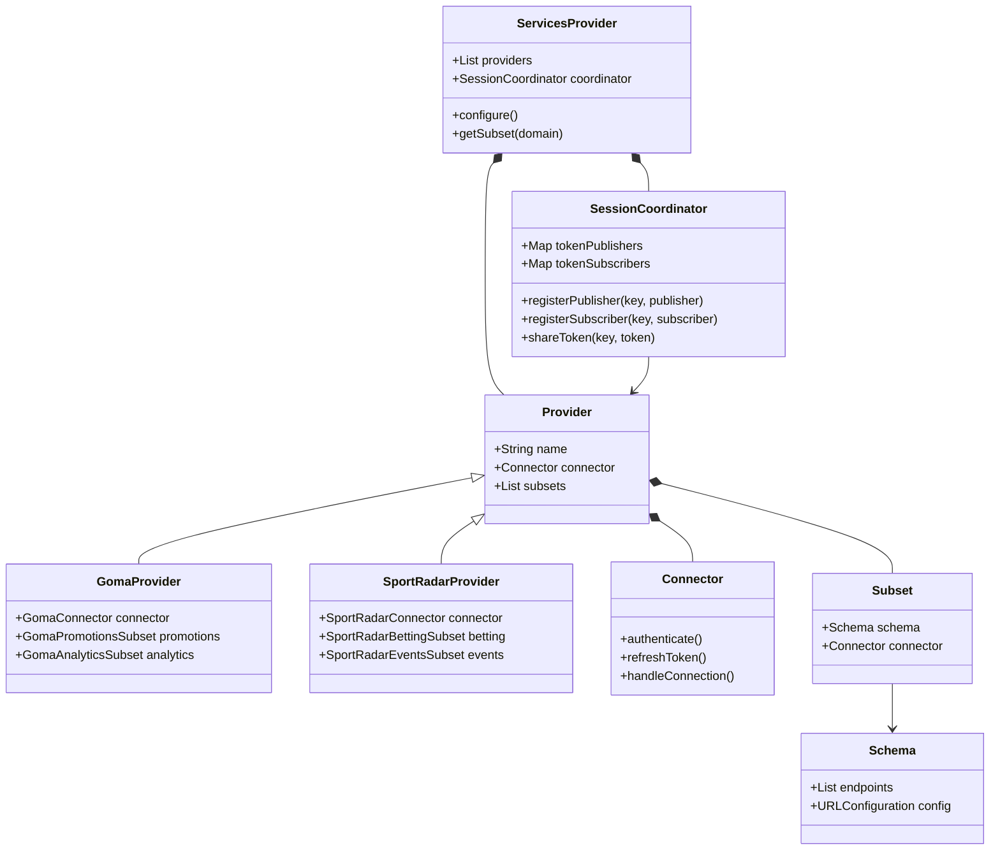
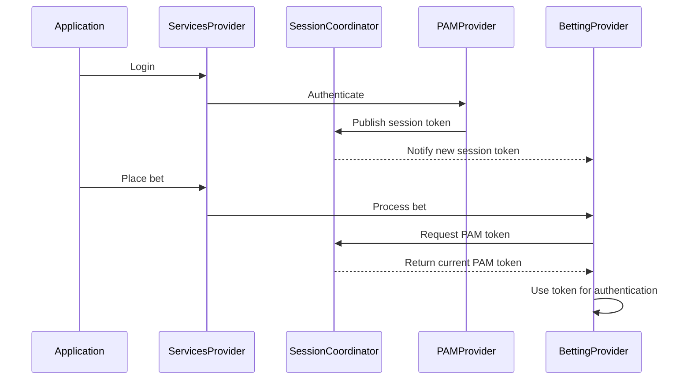
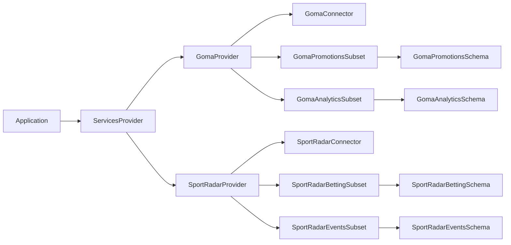
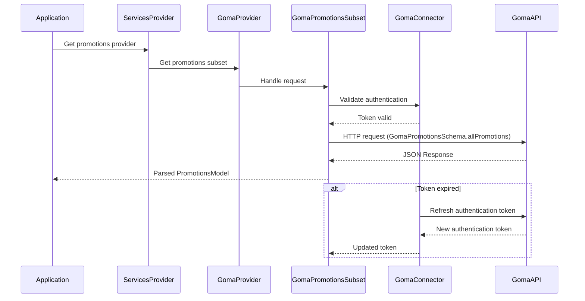
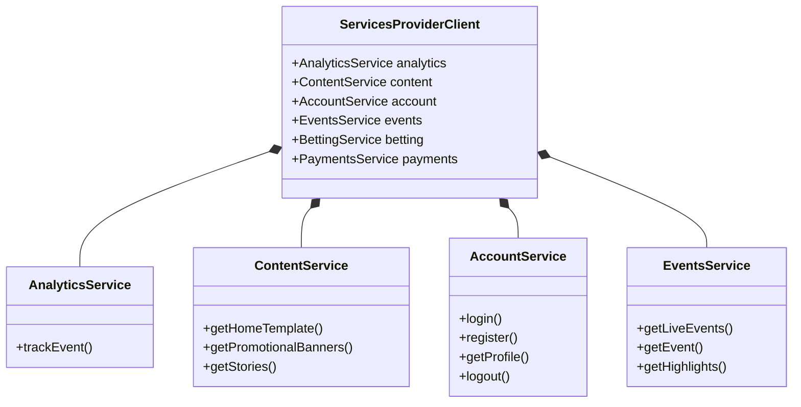

# ServicesProvider Architecture

## Table of Contents
1. [Overview](#overview)
2. [Core Components](#core-components)
3. [Session Management](#session-management)
4. [Provider Implementation](#provider-implementation)
5. [Configuration System](#configuration-system)
6. [Request Flow Patterns](#request-flow-patterns)
7. [Implementation Examples](#implementation-examples)
8. [Client API Organization](#client-api-organization)

## Overview

ServicesProvider is a framework that abstracts third-party service integrations through a protocol-oriented architecture. It enables applications to interact with multiple providers (like Goma, SportRadar) through a unified interface while maintaining clear separation between different service domains.

### Key Features
- Multiple provider support per domain
- Centralized session management
- Protocol-based API abstraction
- Automatic token refresh handling
- Cross-provider state sharing
- Domain-specific subset isolation

### Architecture Diagram



## Core Components

### ServicesProvider
The main entry point for the framework that:
- Manages provider instances
- Coordinates cross-provider communication
- Handles domain-to-provider mapping
- Maintains global configuration

### Provider
A concrete implementation of a third-party service integration:
- Maintains its own Connector instance
- Offers multiple domain-specific Subsets
- Can implement multiple domains
- Examples: `GomaProvider`, `SportRadarProvider`

### Connector
Handles provider-specific connection management:
```swift
protocol Connector {
    var connectionState: AnyPublisher<ConnectionState, Never> { get }
    func authenticate() -> AnyPublisher<Void, Error>
    func refreshToken() -> AnyPublisher<Void, Error>
    func handleConnection()
}
```

### Subset
Implements domain-specific functionality:
- Uses provider's Connector for authentication
- Follows a defined Schema
- Maps to specific Domain
- Examples: `GomaPromotionsSubset`, `SportRadarBettingSubset`

### Schema
Defines the API contract:
Check file: ServicesProvider/Sources/ServicesProvider/Providers/Goma/APIs/GomaAPIPromotionsSchema.swift

### Domain
Available business domains:
```swift
enum Domain {
    case playerAccountManagement    // Handles user account operations
    case bets                      // Manages betting operations
    case bonus                     // Handles bonus and promotion features
    case liveEvents               // Manages real-time sporting events
    case preLiveEvents            // Handles upcoming/scheduled events
    case payments                 // Manages financial transactions
    case responsibleGaming        // Handles responsible gaming features
    case customerSupport          // Manages customer service functionality
    case analytics               // Handles analytics and tracking
}
```

## Session Management

### SessionCoordinator
Manages cross-provider session state:

```swift
final class SessionCoordinator {
    // Token Publishers
    func registerPublisher(_ publisher: Provider, forKey key: String)
    func publishToken(_ token: String, forKey key: String)

    // Token Subscribers
    func registerSubscriber(_ subscriber: Provider, forKey key: String)
    func token(forKey key: String) -> AnyPublisher<String?, Never>

    // Token Management
    func invalidateToken(forKey key: String)
    func clearAllTokens()
}
```

### Token Sharing Flow


## Provider Implementation

### Implementation Flow


### Provider Example
```swift
final class GomaProvider: Provider {
    private let connector: GomaConnector
    private let sessionCoordinator: SessionCoordinator

    let promotionsSubset: GomaPromotionsSubset
    let analyticsSubset: GomaAnalyticsSubset

    init(credentials: ProviderCredentials, sessionCoordinator: SessionCoordinator) {
        self.connector = GomaConnector(credentials: credentials)
        self.sessionCoordinator = sessionCoordinator

        self.promotionsSubset = GomaPromotionsSubset(connector: connector)
        self.analyticsSubset = GomaAnalyticsSubset(connector: connector)

        // Register for PAM session tokens
        sessionCoordinator.registerSubscriber(self, forKey: "pam.session")
    }
}
```

## Configuration System

### Builder Pattern
```swift
let config = Configuration.Builder()
    // Player Account Management through SportRadar
    .useProvider(.sportRadar, forDomain: .playerAccountManagement)
    .withCredentials(.sportRadar, apiKey: "sr-pam-key", secret: "sr-pam-secret")

    // Betting operations through SportRadar
    .useProvider(.sportRadar, forDomain: .myBets)

    // Bonus management through Goma
    .useProvider(.goma, forDomain: .bonus)
    .withCredentials(.goma, apiKey: "goma-key", secret: "goma-secret")

    // Analytics through Goma
    .useProvider(.goma, forDomain: .analytics)

    .withEnvironment(.production)
    .withDeviceUUID("device-uuid")
    .build()
```

## Request Flow Patterns

### Standard Request Flow


## Implementation Examples

### Schema Implementation
```swift
enum GomaPromotionsSchema: Schema {
    // Home Template
    case homeTemplate
    case allPromotions
    case alertBanner
    case banners
    case sportBanners
    case boostedOdds
    case topImageCards
    case heroCards
    case stories
    case news(pageIndex: Int, pageSize: Int)
    case proChoices
    case topCompetitions

    var endpoint: String {
        switch self {
            case .homeTemplate: return "/v1/template/home"
            case .allPromotions: return "/v1/promotions"
            // ... other cases
        }
    }

    var method: HTTP.Method {
        switch self {
            case .homeTemplate, .allPromotions: return .get
            // ... other cases
        }
    }

    // Additional Schema protocol requirements...
}
```

## Client API Organization

### Problem Statement

The current approach with a monolithic `Client` class that exposes all functionality across all domains creates several challenges:

1. The `Client` class becomes a "god object" with excessive responsibility
2. Method discovery is difficult as the API surface grows
3. There's a disconnection between the `Domain` enum and actual API organization
4. Code maintenance becomes challenging with all methods in one class

### Domain-Based Facade Pattern

To address these issues, a domain-based facade pattern is proposed that aligns the client API organization with the domain concepts already defined in the architecture.



### Implementation Approach

#### 1. Domain Service Interfaces

Define protocol-based interfaces for each domain:

```swift
// Domain-specific service interfaces
public protocol AnalyticsService {
    func trackEvent(_ event: AnalyticsTrackedEvent, userIdentifer: String?) -> AnyPublisher<Void, ServiceProviderError>
}

public protocol ContentService {
    func getHomeTemplate() -> AnyPublisher<HomeTemplate, ServiceProviderError>
    func getPromotionalTopBanners() -> AnyPublisher<[PromotionalBanner], ServiceProviderError>
    // Other content-related methods
}

public protocol AccountService {
    func login(username: String, password: String) -> AnyPublisher<LoginResponse, ServiceProviderError>
    func register(userData: RegistrationData) -> AnyPublisher<RegistrationResponse, ServiceProviderError>
    // Other account-related methods
}

// Additional domain services...
```

#### 2. Client Structure

Modify the ServicesProviderClient to expose these domain services:

```swift
public class ServicesProviderClient {
    // Domain-specific service facades
    public let analytics: AnalyticsService
    public let content: ContentService
    public let account: AccountService
    public let events: EventsService
    public let betting: BettingService
    public let payments: PaymentsService
    // etc.

    public init(configuration: Configuration) {
        // Create the domain-specific service implementations
        self.analytics = AnalyticsServiceImpl(config: configuration)
        self.content = ContentServiceImpl(config: configuration)
        self.account = AccountServiceImpl(config: configuration)
        // etc.
    }
}
```

#### 3. Service Implementation

Each service implementation encapsulates provider access for its domain:

```swift
private class AnalyticsServiceImpl: AnalyticsService {
    private let analyticsProvider: AnalyticsProvider?

    init(config: Configuration) {
        // Setup provider from configuration
        if let provider = config.providerMapping[.analytics] {
            // Initialize the proper provider based on configuration
            // Similar to existing setupProviders() logic
        }
    }

    func trackEvent(_ event: AnalyticsTrackedEvent, userIdentifer: String?) -> AnyPublisher<Void, ServiceProviderError> {
        guard let analyticsProvider = self.analyticsProvider else {
            return Fail(error: ServiceProviderError.analyticsProviderNotFound).eraseToAnyPublisher()
        }

        let vaigAnalyticsEvent = SportRadarModelMapper.vaixAnalyticsEvent(fromAnalyticsTrackedEvent: event)
        return analyticsProvider.trackEvent(vaixAnalyticsEvent, userIdentifer: userIdentifer).eraseToAnyPublisher()
    }
}
```

### Client Usage Pattern

Instead of accessing all methods directly on the client:

```swift
// Old approach
Env.servicesProvider.trackEvent(event, userId)
Env.servicesProvider.getHomeTemplate()
```

The domain-based approach provides better organization and discoverability:

```swift
// New approach
Env.servicesProvider.analytics.trackEvent(event, userId)
Env.servicesProvider.content.getHomeTemplate()
```

### Benefits

1. **Improved Discoverability**: Methods are organized by domain, making them easier to find
2. **Clear Responsibility Boundaries**: Each service has a clear and focused responsibility
3. **Reduced Cognitive Load**: Developers only need to understand one domain at a time
4. **Maintainability**: Adding new methods doesn't bloat the main client class
5. **Consistency**: API organization aligns with Domain concept in configuration
6. **Better IDE Support**: Code completion shows only relevant methods for each domain
7. **Simplified Testing**: Each domain service can be mocked independently

### Migration Strategy

To implement this pattern without breaking existing code:

1. Define domain service protocols
2. Create implementations for each service using existing provider logic
3. Update the client to expose these services
4. Add proxy methods in the client that delegate to the appropriate service (for backward compatibility)
5. Gradually migrate application code to use the domain services directly
6. Eventually deprecate and remove the proxy methods from the client

This approach provides a clean, organized API that aligns with the domain-based architecture while allowing for a gradual migration path from the existing codebase.
