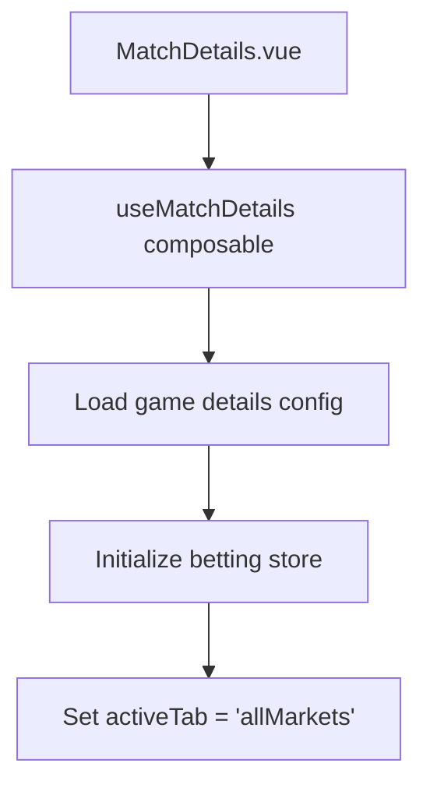
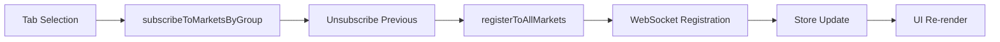
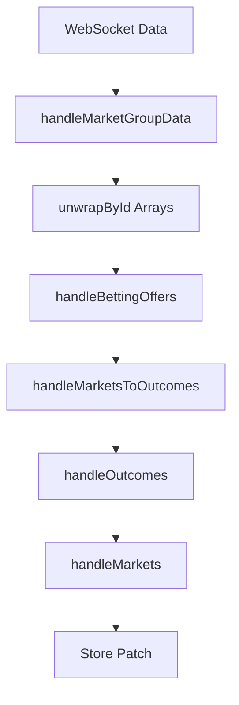

# Match Details Data Architecture Investigation Report

## Executive Summary

This report details the investigation into the data architecture and flow for the "All Markets" tab in the match details page of the sportsbook frontend. The system uses a WebSocket-based real-time data subscription model with the EveryMatrix API to provide live betting odds and market information.

## Architecture Overview

### Core Components

| Component | Location | Purpose |
|-----------|----------|---------|
| **MatchDetails.vue** | `src/pages/Sports/MatchDetails.vue` | Main page component handling UI and data orchestration |
| **useMatchDetails.js** | `src/composables/match-details/useMatchDetails.js` | Composable for match state management and subscriptions |
| **betting.js** | `src/api/everymatrix/modules/betting.js` | API module with WebSocket registration methods |
| **MatchDetailsMarketCard.vue** | `src/components/Widgets/MatchDetails/MatchDetailsMarketCard.vue` | Market rendering component |
| **betting store** | `src/stores/betting.js` | Pinia store for market data persistence |

### Configuration System

The system uses a JSON-based configuration located at:
```
src/api/everymatrix/configs/game_details/game_details.json
```

Key configuration properties:
- `marketTabs.defaultTab: "allMarkets"` - Sets default active tab
- `marketTabs.allMarkets: true` - Enables all markets functionality
- `marketsContent.component: "MatchDetailsMarketCard"` - Defines rendering component

## Data Flow Architecture

### 1. Initialization Phase



**Key Files:**
- `MatchDetails.vue:316` - Component initialization
- `useMatchDetails.js:35` - Config loading via `actions.config.loadGameDetailsConfig()`

### 2. Market Subscription Flow



**Detailed Flow:**

1. **Tab Selection Trigger** (`MatchDetails.vue:316`)
   ```javascript
   function onTabSelected(tab) {
     activeTab.value = tab
     subscribeToMarketsByGroup(tab)
   }
   ```

2. **Market Subscription** (`MatchDetails.vue:277`)
   ```javascript
   async function subscribeToMarketsByGroup(groupKey) {
     if (groupKey === 'allMarkets') {
       const unsubscribe = await oddsApiActions.sports.matchDetails.registerToAllMarkets(matchId.value)
       currentMarketSubscription.value = unsubscribe
     }
   }
   ```

3. **API Registration** (`betting.js:1089`)
   ```javascript
   async registerToAllMarkets(matchId) {
     return apiSession.$wregister({
       url: `/sports/${ucsOperatorId}/${lang}/${matchId}/match-odds`,
       initialDumpUrl: '/sports#initialDump',
       chunkByEntity: ['MARKET', 'OUTCOME', 'MARKET_OUTCOME_RELATION', 'BETTING_OFFER'],
       // ... handlers
     })
   }
   ```

### 3. Data Processing Pipeline



**Processing Steps:**

1. **Data Unwrapping** - Convert arrays to objects for fast lookup
2. **Betting Offers Mapping** - Process betting offers data
3. **Market-Outcome Relations** - Build market → outcome mapping
4. **Outcome Processing** - Map outcomes with betting offers
5. **Market Processing** - Map markets with their outcomes
6. **Store Update** - Patch data to `gameDetails_allMarkets` key

## WebSocket Integration

### Primary Endpoint

**Topic Pattern:**
```
/sports/{operatorId}/{lang}/{matchId}/match-odds
```

**Example:**
```
/sports/betsson_africa/en/12345/match-odds
```

### Registration Parameters

| Parameter | Type | Description |
|-----------|------|-------------|
| `url` | String | WebSocket subscription topic |
| `initialDumpUrl` | String | Initial data dump endpoint (`/sports#initialDump`) |
| `chunkByEntity` | Array | Data chunking strategy |
| `callOnUpdateOnInitialDump` | Boolean | Update handling configuration |

### Data Chunking Strategy

The system processes data in chunks by entity type:
- `MARKET` - Market definitions and metadata
- `OUTCOME` - Available betting outcomes
- `MARKET_OUTCOME_RELATION` - Market-to-outcome mappings
- `BETTING_OFFER` - Odds and betting information

### Real-time Updates

Updates are handled through the `onUpdate` callback:
```javascript
onUpdate(data) {
  if (data) {
    updates.handleUpdate(data)
  }
}
```

## Data Storage Pattern

### Store Key Structure

Data is stored in the betting store using dynamic keys:
```javascript
const storeKey = `gameDetails_${groupKey}`
// Example: gameDetails_allMarkets
```

### Data Structure

```javascript
{
  markets: [
    {
      id: "market_id",
      label: "Match Winner",
      outcomes: [...],
      // ... other market properties
    }
  ],
  outcomes: {
    "outcome_id": {
      id: "outcome_id",
      label: "Team A",
      odds: 1.85,
      // ... other outcome properties
    }
  },
  bettingOffers: {
    "offer_id": {
      id: "offer_id",
      odds: 1.85,
      // ... other offer properties
    }
  }
}
```

## UI Integration

### Data Retrieval

The UI retrieves data through a computed property:
```javascript
const filteredMarkets = computed(() => {
  const storeKey = `gameDetails_${activeTab.value}`
  let marketData = bettingStore.$state[storeKey] || bettingStore[storeKey] || null
  
  if (!marketData?.markets) {
    return []
  }
  
  return marketData.markets
})
```

### Loading State Management

Loading states are managed through reactive refs and watchers:
```javascript
// Set loading when subscription starts
marketsLoading.value = true

// Watch for data arrival and stop loading
watch(() => {
  const storeKey = `gameDetails_${activeTab.value}`
  const marketData = bettingStore.$state[storeKey] || bettingStore[storeKey] || null
  return marketData
}, (marketData) => {
  if (marketData && marketsLoading.value) {
    marketsLoading.value = false
  }
}, { immediate: true })
```

## Subscription Management

### Single Active Subscription Pattern

The system ensures only one market subscription is active at a time:
```javascript
// Unsubscribe from previous subscription if exists
if (currentMarketSubscription.value) {
  currentMarketSubscription.value()
  currentMarketSubscription.value = null
}
```

### Lifecycle Management

Subscriptions are properly managed through Vue's lifecycle:
- **onMounted**: Initialize route watching
- **onUnmounted**: Clean up subscriptions
- **watch**: Monitor match ID changes for re-subscription

## Technical Implementation Details

### API Session Integration

The system uses `apiSession.$wregister()` for WebSocket registration:
- Provides automatic connection management
- Handles reconnection logic
- Manages subscription cleanup

### Error Handling

Error handling is implemented at multiple levels:
```javascript
try {
  const unsubscribe = await oddsApiActions.sports.matchDetails.registerToAllMarkets(matchId.value)
  currentMarketSubscription.value = unsubscribe
} catch (error) {
  console.error('Failed to register to all markets:', error)
  // Additional error handling
}
```

### Performance Optimizations

1. **Data Chunking**: Processes large datasets in chunks by entity type
2. **Computed Properties**: Reactive data retrieval with caching
3. **Single Subscription**: Prevents multiple concurrent subscriptions
4. **Store Patching**: Efficient state updates using Pinia's patch method

## Recent Changes (as of July 2025)

### Dynamic Heights Implementation (commit: feddb981)
- Added progressive rendering system for element height measurement
- Implemented real-time height tracking for statistics sections
- Fixed positioning issues when toggling statistics

### JSON Configuration System (commit: 03147f16)
- Introduced configurable layout system via JSON
- Added dynamic component configuration
- Enabled flexible tab management

### Market Tab Improvements (commit: 00aae7cb)
- Fixed "All Markets" tab functionality
- Enhanced market group mapping
- Improved navigation consistency

## Conclusion

The match details data architecture demonstrates a sophisticated real-time betting system with:
- WebSocket-based live data streaming
- Efficient data processing pipeline
- Robust subscription management
- Configurable UI components
- Proper error handling and loading states

The system is designed for scalability and maintainability, with clear separation of concerns between API interaction, data processing, and UI rendering.