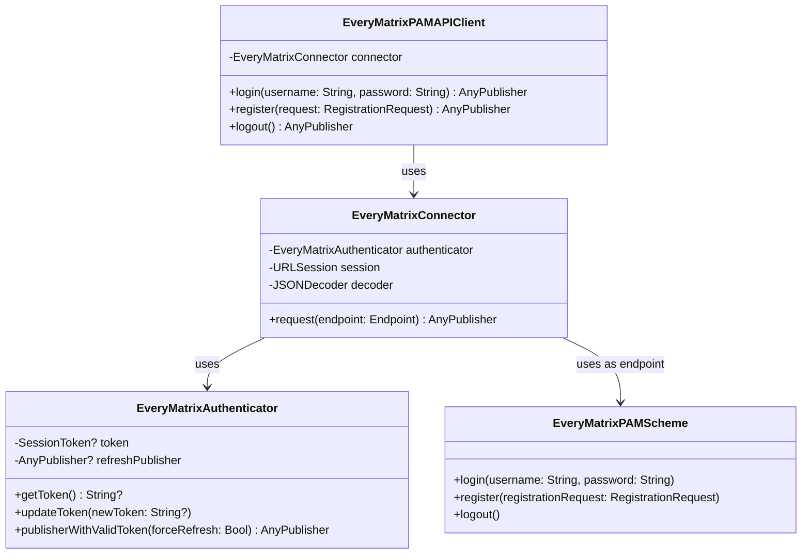

# EveryMatrixAPIClient Authentication Implementation

## Introduction

This document outlines the implementation plan for adding authentication capabilities to the EveryMatrixAPIClient Swift package. The implementation will focus on three core features:

1. **Login**: Authenticating users with username and password
2. **Registration**: Creating new user accounts
3. **Logout**: Terminating active sessions

The authentication flow will be managed by a dedicated authenticator that handles session tokens, similar to the pattern used in the GomaAPIAuthenticator. The connector will use the authenticator to ensure all requests are properly authenticated with valid session tokens.

## Architecture

The authentication system consists of several key components that work together:

**Flow Explanation:**
1. The `EveryMatrixPAMAPIClient` provides a public API for authentication operations
2. It uses the `EveryMatrixConnector` to make authenticated HTTP requests
3. The connector uses the `EveryMatrixAuthenticator` to obtain and refresh session tokens
4. The `EveryMatrixPAMScheme` defines the available endpoints and their configurations
5. When a request fails due to an expired token, the authenticator refreshes it and retries

## Implementation Tasks

### 1. Models Implementation

- [x] 1.1 Create `SessionToken` model with `sessionID` and `universalID` properties
- [x] 1.2 Create `LoginCredentials` model with `username` and `password` properties
- [x] 1.3 Create `RegistrationRequest` model with all required registration fields
- [x] 1.4 Create `RegistrationResponse` model for successful registration data
- [x] 1.5 Create `LogoutResponse` model with confirmation message
- [x] 1.6 Create `APIErrorResponse` model for handling API error responses

### 2. Authenticator Implementation

- [x] 2.1 Create EveryMatrixAuthenticator class
- [x] 2.2 Implement token refresh mechanism
- [-] 2.3 Add token persistence (Moved to consuming apps)
- [x] 2.4 Implement token validation
- [x] 2.5 Add authentication state management

Note: Token persistence has been moved out of the framework's responsibility. Applications consuming this framework will be responsible for implementing their own token persistence strategy.

Authentication state management has been implemented with a comprehensive state enum (`AuthenticationState`) and Combine publishers for state observation. The authenticator now properly manages and publishes state transitions between initial, authenticating, authenticated, and unauthenticated states.

### 3. API Schema Implementation

- [x] 3.1 Update `EveryMatrixPAMScheme` enum with login case
- [x] 3.2 Add register case to schema
- [x] 3.3 Add logout case to schema
- [x] 3.4 Implement URL and endpoint properties for each endpoint
- [x] 3.5 Configure HTTP methods (POST for login, PUT for register, DELETE for logout)
- [x] 3.6 Set up request headers for each endpoint
- [x] 3.7 Implement body encoding for login and register requests

### 4. Connector Implementation

- [x] 4.1 Create `EveryMatrixConnector` class
- [x] 4.2 Add authenticator property and initialization
- [x] 4.3 Implement request method with token handling
- [x] 4.4 Add retry logic for handling 401 unauthorized errors
- [x] 4.5 Implement error mapping for API-specific errors
- [x] 4.6 Add response decoding with proper error handling

### 5. API Client Implementation

- [x] 5.1 Update `EveryMatrixPAMAPIClient` with connector property
- [x] 5.2 Implement login method returning publisher with SessionToken
- [x] 5.3 Implement register method returning publisher with RegistrationResponse
- [x] 5.4 Implement logout method returning confirmation publisher
- [x] 5.5 Add convenience methods for token management

### 6. Configuration

- [x] 6.1 Create configuration class for API endpoints
- [x] 6.2 Configure base URL for different environments (staging and production)

### 7. Testing

- [x] 7.1 Write tests for SessionToken model
- [x] 7.2 Write tests for EveryMatrixAuthenticator
- [x] 7.3 Test token refresh mechanism
- [x] 7.4 Test login flow with valid credentials
- [x] 7.5 Test login flow with invalid credentials
- [x] 7.6 Test registration flow
- [x] 7.7 Test logout flow
- [x] 7.8 Test error handling for various error scenarios

### 8. Documentation

- [x] 8.1 Add documentation comments to public API methods
- [x] 8.2 Create usage examples for login, register, and logout
- [x] 8.3 Document error handling approach

## Next Steps

All the planned tasks for the EveryMatrixAPIClient authentication implementation have been completed. The implementation includes:

1. A robust authentication model with state management
2. A configurable API client that supports different environments
3. Comprehensive test coverage for all components
4. Well-documented public API for ease of use

The authentication system follows the established pattern from the GomaAPIAuthenticator but has been tailored to the specific requirements of the EveryMatrix API. The implementation is flexible and can be extended with additional features in the future.