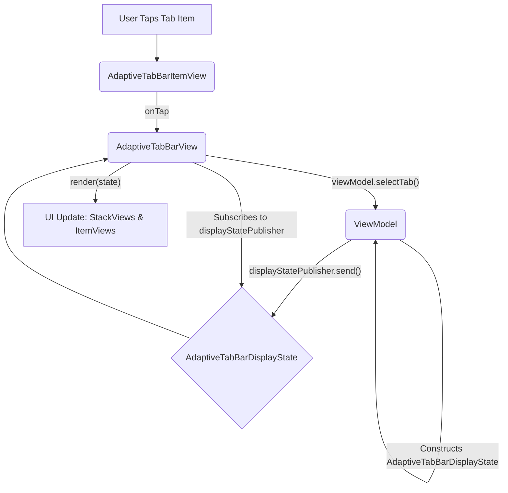

# Architecture

The `AdaptiveTabBarView` component is designed with a ViewModel-driven architecture, emphasizing a clear separation of concerns to enhance testability, maintainability, and predictability. This document outlines the core architectural principles and the roles of its key constituents.

## Core Principles

1.  **ViewModel as the Single Source of Truth**: The ViewModel is responsible for managing all state related to the tab bar. This includes:
    *   The structure and content of all available tab bars.
    *   The currently active (visible) tab bar.
    *   The selected item within each tab bar.
    *   The appearance details (icon, title, active state) for each tab item.

2.  **Reactive Updates via Display State**: The ViewModel exposes a single Combine publisher, `displayStatePublisher`, which emits a comprehensive `AdaptiveTabBarDisplayState` object. The `AdaptiveTabBarView` subscribes to this publisher and updates its entire UI based on the received state. This makes the View a passive renderer of the state provided by the ViewModel.

3.  **Dumb View Components**: The UIViews (`AdaptiveTabBarView` and `AdaptiveTabBarItemView`) are kept as "dumb" as possible. Their primary responsibilities are:
    *   Rendering the UI based on the data provided (via `AdaptiveTabBarDisplayState` and `TabItemDisplayData`).
    *   Forwarding user interactions (like taps on tab items) to the ViewModel.
    *   They do not hold significant business logic or mutable state beyond what's necessary for their immediate rendering task or managing their subviews.

4.  **Unidirectional Data Flow (Simplified)**: User actions are sent to the ViewModel (e.g., `viewModel.selectTab(...)`). The ViewModel processes the action, updates its internal state, and then publishes a new `AdaptiveTabBarDisplayState`. The View receives this new state and re-renders. This creates a predictable data flow.

## Key Components and Their Roles

1.  **`AdaptiveTabBarViewModelProtocol` (and its implementations, e.g., `MockAdaptiveTabBarViewModel`)**
    *   **Responsibilities**: 
        *   Holds the definitive internal state of all tab bars (using `TabBar` and `TabItem` structs).
        *   Contains all business logic for tab selection, switching between tab bars, and determining active states.
        *   Constructs and publishes the `AdaptiveTabBarDisplayState` whenever its internal state changes.
    *   **Key Interface**: `displayStatePublisher`, `selectTab(itemID:inTabBarID:)`.

2.  **`AdaptiveTabBarDisplayState` (Struct)**
    *   **Purpose**: A comprehensive, immutable struct that represents everything the `AdaptiveTabBarView` needs to render itself at a given point in time.
    *   **Contents**: An array of `TabBarDisplayData` and the `activeTabBarID`.

3.  **`TabBarDisplayData` (Struct)**
    *   **Purpose**: Represents a single tab bar (a set of tabs) to be displayed.
    *   **Contents**: The `id` of the tab bar and an array of `TabItemDisplayData`.

4.  **`TabItemDisplayData` (Struct)**
    *   **Purpose**: Represents a single tab item to be displayed.
    *   **Contents**: `identifier`, `title`, `icon`, `isActive` status, and `switchToTabBar` information.

5.  **`AdaptiveTabBarView.swift` (UIView Subclass)**
    *   **Responsibilities**:
        *   Initializes with an object conforming to `AdaptiveTabBarViewModelProtocol`.
        *   Subscribes to the `viewModel.displayStatePublisher`.
        *   Implements a `render(state: AdaptiveTabBarDisplayState)` method that updates the UI:
            *   Manages a map of `UIStackView`s (`stackViewMap`), one for each `TabBarIdentifier`.
            *   Adds, removes, or updates these stack views based on the `tabBars` in the received `AdaptiveTabBarDisplayState`.
            *   For each `TabBarDisplayData`, it clears and re-populates the corresponding `UIStackView` with `AdaptiveTabBarItemView` instances.
            *   Creates and configures each `AdaptiveTabBarItemView` using the `TabItemDisplayData`.
            *   Sets up tap handling for each item view to call `viewModel.selectTab(...)`.
            *   Controls the visibility of the `UIStackView`s based on the `activeTabBarID` from the display state.
        *   Provides an `onTabSelected` callback for consumers of the view.

6.  **`AdaptiveTabBarItemView.swift` (UIView Subclass)**
    *   **Responsibilities**:
        *   Displays a single tab item (icon and title).
        *   Configured directly via a `configure(with: TabItemDisplayData)` method.
        *   Updates its appearance (e.g., colors, alpha for active/inactive state) based on the `isActive` flag in the `TabItemDisplayData`.
        *   Handles tap gestures and executes an `onTap` closure (which is set up by `AdaptiveTabBarView` to call the ViewModel).

## Flow of Data and Actions

This architecture ensures that the state logic is centralized and testable within the ViewModel, while the Views remain focused on presentation and user input forwarding. 