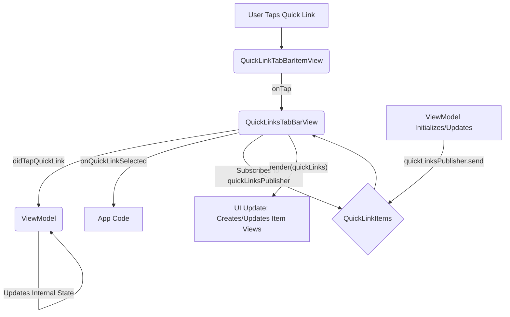

# Architecture

The `QuickLinksTabBar` component is designed with a simple ViewModel-driven architecture, emphasizing a clean separation of concerns to enhance testability, maintainability, and flexibility. This document outlines the core architectural principles and the roles of its key constituents.

## Core Principles

1. **ViewModel as the Single Source of Truth**: The ViewModel is responsible for managing all state related to the quick links. This includes:
   * The collection of available quick link items.
   * Any internal state tracking related to the links.

2. **Reactive Updates via Publisher**: The ViewModel exposes a single Combine publisher, `quickLinksPublisher`, which emits an array of `QuickLinkItem` objects. The `QuickLinksTabBarView` subscribes to this publisher and updates its UI based on the received items. This makes the View a passive renderer of the state provided by the ViewModel.

3. **Dumb View Components**: The UIViews (`QuickLinksTabBarView` and `QuickLinkTabBarItemView`) are kept as "dumb" as possible. Their primary responsibilities are:
   * Rendering the UI based on the data provided (via `[QuickLinkItem]`).
   * Forwarding user interactions (like taps on items) to the ViewModel and through the callback.
   * They do not hold significant business logic or mutable state beyond what's necessary for rendering.

4. **Type-Safe Link Identifiers**: All quick links are identified by a `QuickLinkType` enum rather than strings, ensuring type safety when handling taps and managing links.

5. **Simple Callback Mechanism**: The component uses a simple closure-based callback approach for handling user interactions, making it easy to integrate within different architectural patterns (MVC, MVVM, etc.).

## Key Components and Their Roles

1. **`QuickLinksTabBarViewModelProtocol` (and its implementations, e.g., `MockQuickLinksTabBarViewModel`)**
   * **Responsibilities**: 
     * Provides the collection of quick link items.
     * Handles and potentially logs or tracks taps on items.
   * **Key Interface**: `quickLinksPublisher`, `didTapQuickLink(type:)`.

2. **`QuickLinkItem` (Struct)**
   * **Purpose**: Represents a single quick link with all the information needed to render it and identify its type.
   * **Contents**: `type`, `title`, and `icon`.

3. **`QuickLinkType` (Enum)**
   * **Purpose**: Type-safe identifier for different types of quick links.
   * **Contents**: Cases representing the various link types (e.g., `aviator`, `slots`, `promos`).

4. **`QuickLinksTabBarView.swift` (UIView Subclass)**
   * **Responsibilities**:
     * Initializes with an object conforming to `QuickLinksTabBarViewModelProtocol`.
     * Subscribes to the `quickLinksPublisher`.
     * Renders the quick links horizontally in a stack view.
     * Handles user taps and forwards them to the ViewModel and through a callback.
   * **Key Interface**: Initializer taking a ViewModel, `onQuickLinkSelected` callback.

5. **`QuickLinkTabBarItemView.swift` (UIView Subclass)**
   * **Responsibilities**:
     * Displays a single quick link item (icon and title).
     * Handles tap gestures and executes an `onTap` closure.
   * **Key Interface**: `configure(with:)` method, `onTap` closure.

## Flow of Data and Actions

This architecture ensures that the state logic is centralized within the ViewModel, while the Views remain focused on presentation and user input forwarding. The simplicity of the component's architecture makes it easy to understand, maintain, and integrate within various iOS applications. 