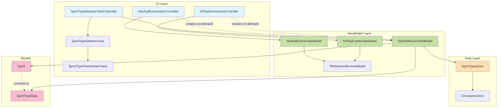
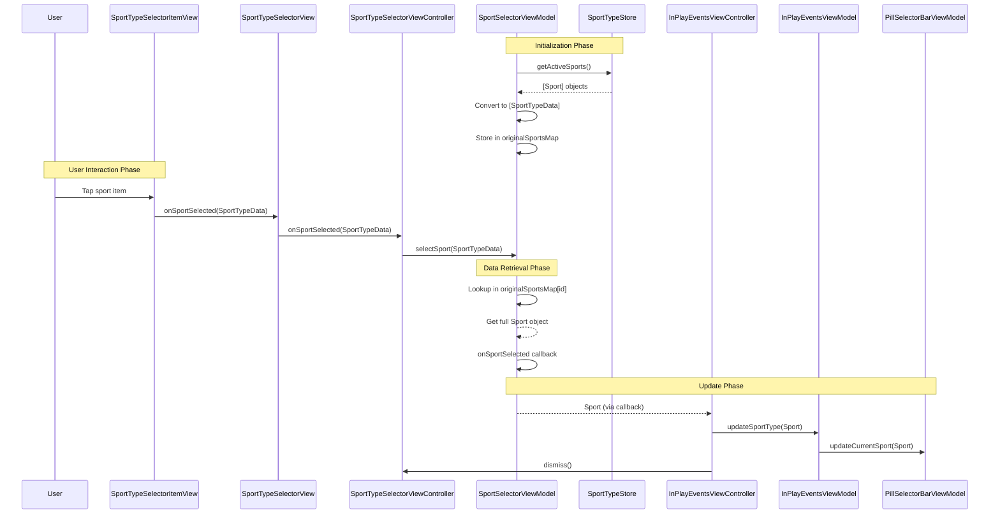
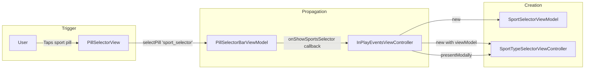
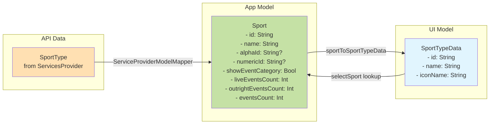
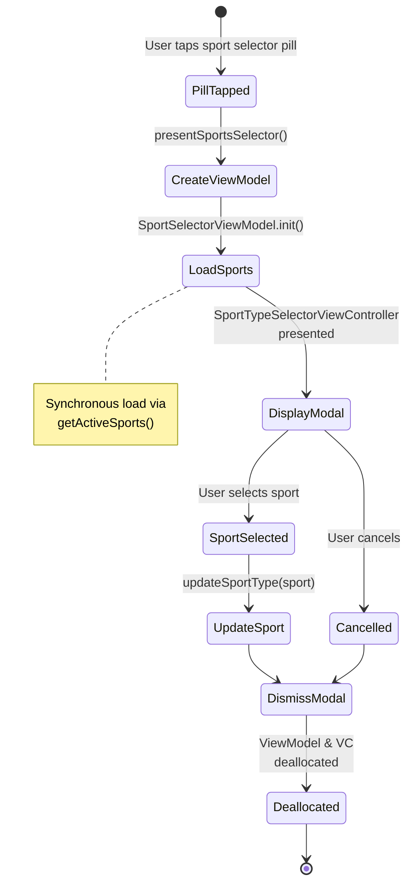

# Sport Selector Architecture

## Overview
This document visualizes the architecture of the Sport Selector feature, showing dependencies, data flow, and action sequences.

## Component Dependencies



## Data Flow - Sport Selection



## Action Flow - Opening Sport Selector



## Data Model Transformation



## Lifecycle Management



## Memory Management Strategy

```mermaid
graph TB
    subgraph "Old Approach ❌"
        direction TB
        PVM1[Parent ViewModel] -->|owns| SSM1[SportSelectorViewModel]
        SSM1 -->|subscribes to| PUB1[activeSportsPublisher]
        PUB1 -->|continuous updates| SSM1
        SSM1 -->|stores| MAP1[originalSportsMap]
        MAP1 -->|long-lived references| CRASH[Memory Corruption]
        
        style CRASH fill:#ff5252
    end
    
    subgraph "New Approach ✅"
        direction TB
        PVM2[Parent ViewModel] -.->|creates on-demand| SSM2[SportSelectorViewModel]
        SSM2 -->|synchronous call| GAS[getActiveSports()]
        GAS -->|immediate return| SSM2
        SSM2 -->|stores briefly| MAP2[originalSportsMap]
        MODAL[Modal Dismissed] -->|deallocates| SSM2
        
        style SSM2 fill:#66bb6a
        style MAP2 fill:#66bb6a
    end
```

## Key Architecture Decisions

### 1. On-Demand ViewModel Creation
- SportSelectorViewModel created only when modal is presented
- Automatically deallocated when modal is dismissed
- Prevents long-lived subscriptions and memory issues

### 2. Synchronous Data Loading
- Uses `getActiveSports()` instead of `activeSportsPublisher`
- No need for live updates in a modal context
- Eliminates memory corruption from subscription updates

### 3. Data Preservation Strategy
- `originalSportsMap` stores full Sport objects temporarily
- Safe because lifecycle is short (modal presentation duration)
- Preserves all Sport properties (alphaId, event counts, etc.)

### 4. Callback Chain
- ViewController handles UI callbacks (SportTypeData)
- ViewModel handles business logic (Sport)
- Clear separation of concerns between layers