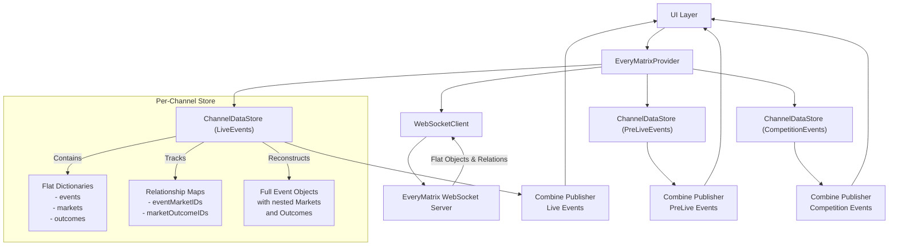
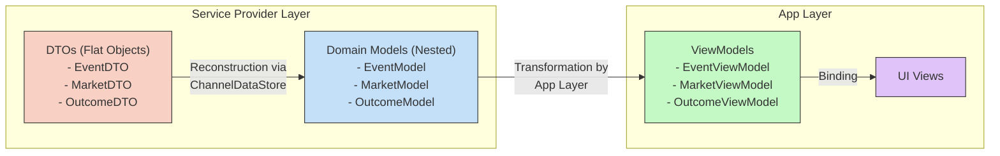
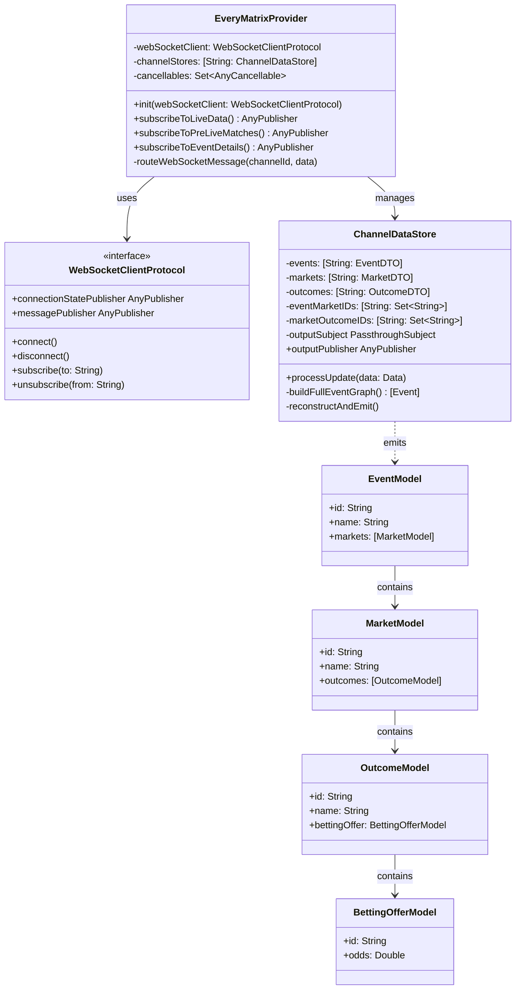
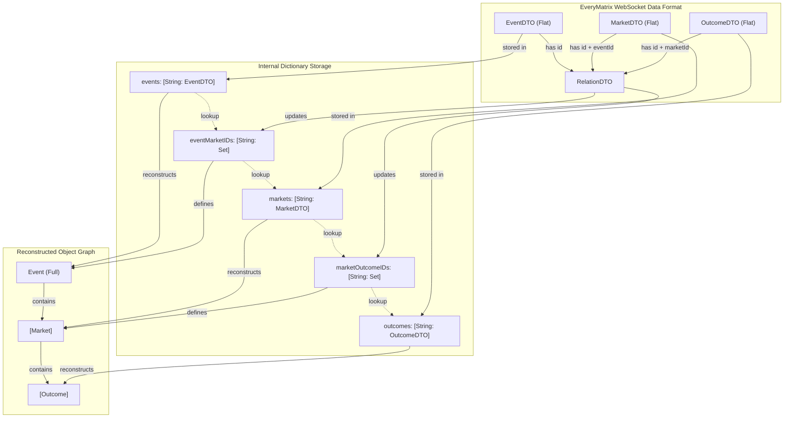
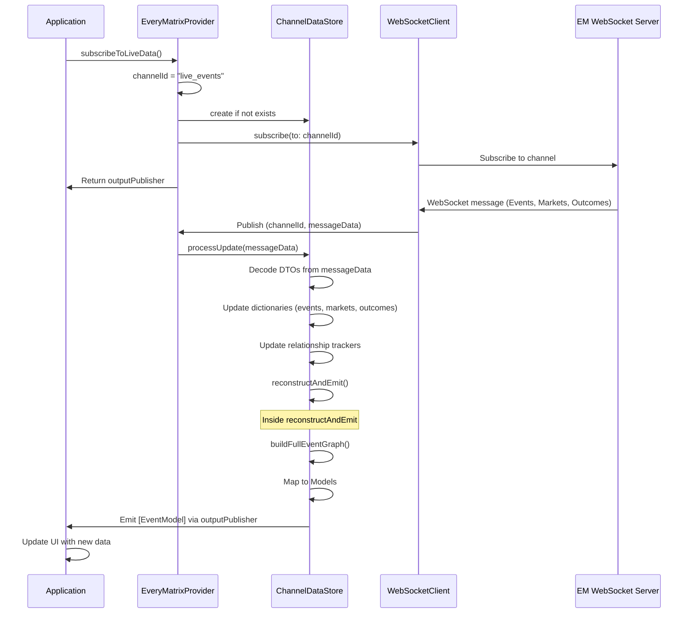
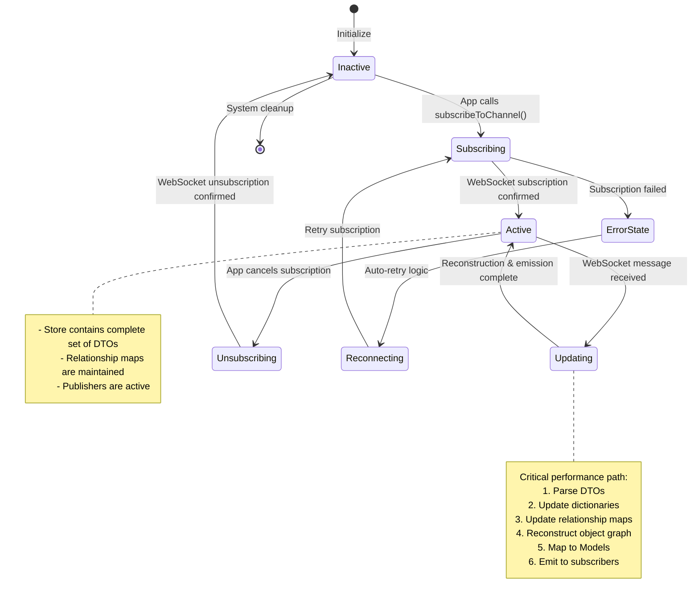

# EveryMatrix Service Provider Implementation Plan

## 1. Problem Definition

The integration of the EveryMatrix (EM) WebSocket API presents several architectural challenges for providing real-time sports betting data within the iOS application:

*   **Normalized Data Stream:** Unlike traditional nested structures (e.g., JSON where an event contains an array of markets), EM sends flat, independent objects (Events, Markets, Outcomes) over the WebSocket.
*   **Pointer-Based Relationships:** Objects are linked via identifiers (IDs). For instance, a Market object contains an `eventId`, and an Outcome object contains a `marketId`. Reconstructing the familiar nested `Event -> [Market] -> [Outcome]` hierarchy requires resolving these pointers.
*   **Real-time Requirement:** Sports betting demands low-latency updates. Odds change frequently, and the UI must reflect these changes almost instantaneously. The data processing and reconstruction pipeline must be highly performant.
*   **Channel Isolation:** Subscriptions to different WebSocket channels (e.g., "Live Events", "Pre-Match Events for Sport X") must be managed independently. Data received on one channel should not mix with or affect the data presented for another channel. Consumers subscribing to "Live Events" should only receive live events, correctly reconstructed.
*   **Scalability & Resource Management:** The solution must handle potentially large numbers of events, markets, and outcomes, along with frequent updates, without excessive memory consumption or performance degradation.

## 2. Proposed Solution: Pure In-Memory Store per Channel

We will implement a solution centered around maintaining separate, in-memory data stores for each active WebSocket channel subscription. This approach prioritizes performance and reactivity while ensuring strict channel isolation.

**Core Concepts:**

*   **`ChannelDataStore`:** A dedicated class or struct responsible for managing the state for a *single* WebSocket channel subscription. It will hold the raw, normalized data received from the WebSocket and manage the reconstruction process.
*   **Flat Dictionaries:** Within each `ChannelDataStore`, data will be stored in dictionaries keyed by object ID (e.g., `[EventID: EventDTO]`, `[MarketID: MarketDTO]`). This allows for O(1) average time complexity for lookups and updates.
*   **Relationship Tracking:** Explicit dictionaries or sets will track parent-child relationships (e.g., `[EventID: Set<MarketID>]`, `[MarketID: Set<OutcomeID>]`). These are updated based on incoming relation messages or implicit IDs within the DTOs (Data Transfer Objects).
*   **Reconstruction on Update:** When new data arrives via WebSocket, the relevant `ChannelDataStore` updates its dictionaries and relationship trackers. It then reconstructs the *full object graph* (e.g., `[Event]`, where each Event contains its Markets and Outcomes) relevant *only to that channel*.
*   **Reactive Emissions:** The reconstructed data (likely mapped to ViewModels) is emitted to downstream consumers using Combine Publishers (`PassthroughSubject` or `CurrentValueSubject`) or Swift Concurrency's `AsyncStream`.
*   **Provider Facade (`EveryMatrixProvider`):** Acts as the main entry point, manages multiple `ChannelDataStore` instances (one per active subscription), interacts with the WebSocket client, and exposes the reactive streams to the application layer.

### Component Architecture Diagram



## 3. Detailed Components

*   **`WebSocketClientProtocol` / `EMWebSocketConnection`:**
    *   **Responsibility:** Handles the underlying WebSocket connection, authentication, sending subscription messages, receiving raw messages, and routing them to the correct `EveryMatrixProvider` handler based on the channel.
    *   **Interface (Conceptual):**
        ```swift
        protocol WebSocketClientProtocol {
            // Connects/disconnects the socket
            func connect()
            func disconnect()

            // Publishes connection state updates
            var connectionStatePublisher: AnyPublisher<WebSocketConnectionState, Never> { get }

            // Sends subscription requests for specific channels
            func subscribe(to channelId: String)

            // Sends unsubscription requests
            func unsubscribe(from channelId: String)

            // Publishes received messages, tagged with their channel
            var messagePublisher: AnyPublisher<(channelId: String, message: Data), Error> { get }
        }
        ```
*   **Data Transfer Objects (DTOs):**
    *   **Responsibility:** Raw structures mirroring the flat objects received directly from the EM WebSocket (e.g., `EventDTO`, `MarketDTO`, `OutcomeDTO`, `RelationDTO`). These contain the IDs necessary for linking.
    *   **Example:**
        ```swift
        struct EventDTO: Decodable {
            let id: String
            let name: String
            // ... other flat properties
        }

        struct MarketDTO: Decodable {
            let id: String
            let eventId: String // Pointer to parent
            let name: String
            // ... other flat properties
        }
        ```
*   **`ChannelDataStore`:**
    *   **Responsibility:** State management for one channel. Stores DTOs, tracks relationships, performs reconstruction, emits view models.
    *   **Internal State (Conceptual):**
        ```swift
        struct ChannelDataStore {
            private var events: [String: EventDTO] = [:]
            private var markets: [String: MarketDTO] = [:]
            private var outcomes: [String: OutcomeDTO] = [:]
            private var eventMarketIDs: [String: Set<String>] = [:]
            private var marketOutcomeIDs: [String: Set<String>] = [:]

            // Publisher for consumers
            private let outputSubject = PassthroughSubject<[EventModel], Never>() // Or CurrentValueSubject/AsyncStream
            var outputPublisher: AnyPublisher<[EventModel], Never> {
                outputSubject.eraseToAnyPublisher()
            }
            // ... methods for processing updates and reconstruction ...
        }
        ```
*   **Domain Models:**
    *   **Responsibility:** The fully reconstructed, nested structures that represent the core domain objects of the Swift package's public API (e.g., `EventModel`, `MarketModel`, `OutcomeModel`). These are created *after* reconstruction from DTOs but *before* any UI-specific transformation.
    *   **Example:**
        ```swift
        struct EventModel {
            let id: String
            let name: String
            let markets: [MarketModel]
            // ... other relevant properties for the domain model
        }
        ```
    *   **Note:** Keep domain models separate from UI-specific ViewModels, which would be created in the app layer. The domain models are part of the service provider's public interface, while ViewModels would contain UI-specific logic and transformations.

### Data Transformation Flow



This diagram illustrates the clear separation of concerns across architectural layers:

1. **DTOs (Data Transfer Objects)** - Raw structures received from the EveryMatrix WebSocket. They are flat and contain only the data needed for transport.

2. **Domain Models** - Fully constructed domain objects that form the public API of the ServicesProvider package. These maintain proper object relationships (Event contains Markets, which contain Outcomes) and expose a clean, consistent interface for consumers.

3. **ViewModels** - Created by the app layer (not this package), these objects transform domain models for specific UI needs, potentially adding display logic, formatting, computed properties, etc.

The architecture maintains clear boundaries between these layers, allowing the service layer to focus on data acquisition and domain model construction without concerns about UI presentation.

*   **`EveryMatrixProvider`:**
    *   **Responsibility:** Manages the lifecycle of `ChannelDataStore` instances, interacts with the `WebSocketClientProtocol`, handles subscription requests from the app, and exposes the channel-specific `outputPublisher`s.
    *   **Internal State (Conceptual):**
        ```swift
        class EveryMatrixProvider: EventsProvider { // Conforms to your existing protocol
            private let webSocketClient: WebSocketClientProtocol
            private var channelStores: [String: ChannelDataStore] = [:]
            private var cancellables = Set<AnyCancellable>()

            init(webSocketClient: WebSocketClientProtocol) {
                self.webSocketClient = webSocketClient
                // Subscribe to webSocketClient.messagePublisher to route messages
            }

            func subscribeToLiveData() -> AnyPublisher<SubscribableContent<[EventsGroup]>, ServiceProviderError> {
                 let channelId = "live_events_channel" // Example channel identifier
                 // Get or create ChannelDataStore for channelId
                 // Call webSocketClient.subscribe(to: channelId)
                 // Return the store's outputPublisher, mapped appropriately
            }
            // ... other subscription methods for different channels ...
        }
        ```

### Class Structure Diagram



### Data Structure Relationships Diagram



## 4. Data Flow

1.  **Subscription Request:** Application requests data (e.g., live events) via `EveryMatrixProvider`.
2.  **Provider Action:** `EveryMatrixProvider` identifies the appropriate `channelId`.
3.  **Store Creation:** If no `ChannelDataStore` exists for `channelId`, it creates one.
4.  **WebSocket Subscription:** `EveryMatrixProvider` tells `WebSocketClientProtocol` to subscribe to the EM channel.
5.  **WebSocket Message Received:** `WebSocketClientProtocol` receives a message for `channelId`.
6.  **Message Routing:** `WebSocketClientProtocol` publishes `(channelId, messageData)`. `EveryMatrixProvider` receives this.
7.  **Store Update:** `EveryMatrixProvider` finds the correct `ChannelDataStore` for `channelId` and passes the `messageData` to its processing method.
8.  **DTO Parsing & Storage:** `ChannelDataStore` decodes DTOs from `messageData`, updates its internal flat dictionaries (`events`, `markets`, etc.), and updates relationship trackers (`eventMarketIDs`, etc.).
9.  **Reconstruction:** `ChannelDataStore` triggers its internal reconstruction logic, iterating through its stored DTOs and relationships to build the full, nested `[Event]` structure *for that channel*.
10. **ViewModel Mapping:** The reconstructed `[Event]` is mapped to `[EventModel]`.
11. **Emission:** `ChannelDataStore` sends the `[EventModel]` array through its `outputSubject`.
12. **Application Update:** The application layer, subscribed to the `outputPublisher` returned in Step 1, receives the updated list of models and updates the UI.

### Data Flow Sequence Diagram



## 5. Tricky Parts & Warnings

*   **Reconstruction Performance:** The `buildFullEventGraph` (or equivalent) function inside `ChannelDataStore` is performance-critical. It must be highly optimized. Avoid nested loops where possible, leverage dictionary lookups. Profile this section under load. Consider if delta updates (only reconstructing affected objects) are feasible/necessary if full reconstruction becomes too slow.
*   **Memory Usage:** Storing all active objects in memory can consume significant RAM, especially with many concurrent subscriptions or very large events/competitions. Monitor memory footprint. Implement cleanup logic in `EveryMatrixProvider` to remove `ChannelDataStore` instances when subscriptions end (and call `webSocketClient.unsubscribe`). Consider strategies like only storing *active* data if memory becomes an issue (though this adds complexity).
*   **Thread Safety / Concurrency:**
    *   WebSocket message processing and `ChannelDataStore` updates should likely happen on a dedicated background queue/actor to avoid blocking the main thread.
    *   Accessing and modifying the `ChannelDataStore`'s internal state must be synchronized if multiple threads could potentially access it (e.g., if reconstruction happens concurrently with new message processing). Using an Actor for `ChannelDataStore` can help manage this.
    *   Ensure emissions (`outputSubject.send`) are dispatched to the appropriate thread/queue expected by the consumer (often the main thread for UI updates). Use `receive(on:)` in the Combine chain.
*   **Data Consistency:** While unlikely to be a major issue with WebSocket streams, ensure that the order of processing updates maintains a logical state. Handle potential race conditions if updates for related objects arrive out of order (though the EM protocol likely handles this).
*   **Error Handling:** Robustly handle WebSocket connection errors, decoding errors, and subscription failures. Propagate meaningful errors up through the Combine/AsyncStream pipelines. Implement retry logic for transient connection issues in the `WebSocketClientProtocol`.
*   **Initial State / Snapshots:** How is the initial state loaded when a subscription starts? Does EM send a full snapshot first, followed by delta updates? The `ChannelDataStore` needs to handle both initial bulk loads and incremental updates correctly.

### Channel Subscription State Diagram



## 6. Testability

This architecture is designed for testability:

*   **Dependency Injection:** Inject `WebSocketClientProtocol` into `EveryMatrixProvider`. This allows mocking the WebSocket layer entirely for testing the provider's logic.
*   **`ChannelDataStore` Isolation:** `ChannelDataStore` can be tested independently. Create instances, feed them sample DTO arrays and relationship data via its processing methods, and assert that the `outputPublisher` emits the correctly reconstructed `EventModel` structures. Test edge cases (missing objects, broken relationships, empty data).
*   **`WebSocketClientProtocol` Mocking:** Create a `MockWebSocketClient` conforming to the protocol. Use it to simulate connection states, message delivery (including specific orderings or malformed data), and subscription acknowledgments/errors.
*   **Model Testing:** Models should be simple data holders, easy to instantiate and compare in tests.

By testing each component in isolation and then integration testing (`EveryMatrixProvider` with a `MockWebSocketClient`), we can build high confidence in the implementation.

## 7. Future Considerations

*   **Throttling/Debouncing:** If UI updates become overwhelming due to high-frequency odds changes, consider applying `.throttle` or `.debounce` to the Combine stream just before it reaches the UI layer (not within the core provider, as that would delay data processing).
*   **Alternative Data Structures:** If dictionary lookups and reconstruction become a proven bottleneck (after profiling), more advanced in-memory graph data structures could be explored, but this significantly increases complexity. Stick with dictionaries initially.